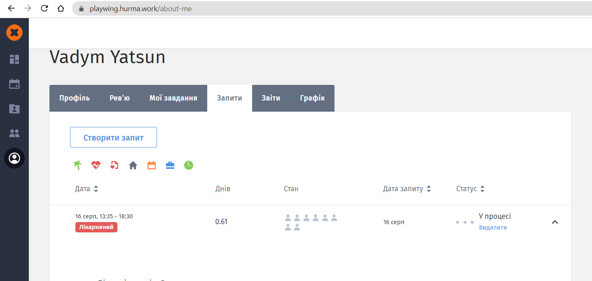

# Chapter 1
git push origin master

print('hello, world')



[Link text Here](https://www.google.com/)

## Ex 1-1

## Ex 1-2

## EX 1-3

## Ex 2-1

## Ex 2-2

## EX 2-3

## Ex 2-4

## Ex 2-5

## EX 2-6
```
name = ("Dima")
print("Hello " +  name + "," + " would you like to learn some Python today?")
```


